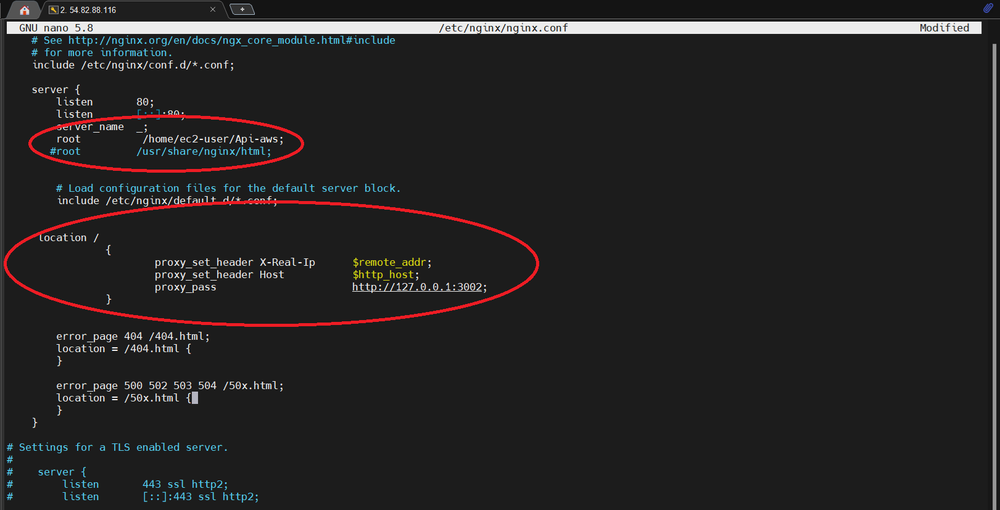

**PROBAR CODIGO DE FOMRA LOCAL UTILIZANDO POSTGRES**
  1. Tener instalado node en windows o linux
  2. Tener instalado Postgres en windows o linux
  3. Crear una base de datos en Postgres con el nombre "prueba"
  4. Crear una tabla en la base de datos "prueba" con el nombre "usuario"
  5. Puede utilizar PgAdmin4 para administrar a base de datos local

*Instalando dependencias*
  1. Estando en Visual Studio abrir la carpeta del proyecto
  2. Abrir la terminal y escribir "npm i pg express" para instalar los modulos necesarios
  3. Abrir el archivo llamado conexion.js que esta en la carpeta controllers y modificar según la informacion de su base de datos. 
  4. Guardar todos los cambios
  5. Abrir la terminal y escribir "node main.js" para ejecutar y correr en el puerto.
  6. Abrir el navegador y escribir "http://localhost:3002/usuario" para que se muestre la consulta 

**COMANDOS SQL PARA LA CREACION DE LAS TABLAS Y USUARIOS**

1. Crear una tabla a esa base de datos, por ejemplo usuario:

CREATE TABLE usuario (
    id SERIAL PRIMARY KEY,
    nombre VARCHAR(100),
    apellido VARCHAR(100),
    correo TEXT,
    telefono VARCHAR(20)
);

CREATE TABLE productos (
    id SERIAL PRIMARY KEY,
    nombre VARCHAR(255),
    precio DECIMAL(10, 2),
    estado VARCHAR(20) CHECK (estado IN ('disponible', 'agotado')),
    imagen_url TEXT
);

CREATE TABLE clientes (
    id SERIAL PRIMARY KEY,
    nombre VARCHAR(255),
    nombre2 VARCHAR(255),
    apellido VARCHAR(255),
    apellido2 VARCHAR(255),
    direccion VARCHAR(255),
    correo TEXT,
    telefono VARCHAR(20)
);

CREATE TABLE ordenes (
    id SERIAL PRIMARY KEY,
    cliente_id INTEGER NOT NULL,
    producto_id INTEGER NOT NULL,
    cantidad INTEGER NOT NULL,
    fecha TIMESTAMP NOT NULL DEFAULT CURRENT_TIMESTAMP,
    FOREIGN KEY (cliente_id) REFERENCES clientes(id),
    FOREIGN KEY (producto_id) REFERENCES productos(id)
);

3. Ingresar datos a la db:

INSERT INTO usuario (nombre, apellido, correo, telefono) VALUES ('Juan', 'Perez', 'juan.perez@example.com', '123-456-7890');
INSERT INTO usuario (nombre, apellido, correo, telefono) VALUES ('Ana', 'Gomez', 'ana.gomez@example.com', '098-765-4321');
INSERT INTO usuario (nombre, apellido, correo, telefono) VALUES ('Carlos', 'Sanchez', 'carlos.sanchez@example.com', '555-555-5555');

-- Insertar un producto
INSERT INTO productos (nombre, precio, estado, imagen_url)
VALUES ('Producto 1', 29.99, 'disponible', 'https://s3.amazonaws.com/tu-bucket/imagen1.jpg');

-- Insertar otro producto
INSERT INTO productos (nombre, precio, estado, imagen_url)
VALUES ('Producto 2', 49.99, 'disponible', 'https://s3.amazonaws.com/tu-bucket/imagen2.jpg');

-- Insertar un producto agotado
INSERT INTO productos (nombre, precio, estado, imagen_url)
VALUES ('Producto 3', 19.99, 'agotado', 'https://s3.amazonaws.com/tu-bucket/imagen3.jpg');

**UTILIZANDO POSTMAN CON METODO GET**
1. Descargar postman
2. Abrir postman y crear una nueva solicitud
3. Seleccionar el metodo GET y escribir la url "http://localhost:3002/usuario (hará una consulta de los usurios)
4. Presionar el botón "Send" para enviar la solicitud
5. Se mostrarán los resultados en la sección "Body" de postman

**UTILIZANDO POSTMAN CON METODO POST**
1. crear una solicitud post
2. Seleccionar el metodo POST y escribir la url "http://localhost:3002/usuario
3. En la sección "Body" de postman, seleccionar "raw" 
4. En el campo de texto, escribir en formato JSON los datos del usuario que se quiere
agregar, por ejemplo:

{
"nombre": "Huber",
"apellido": "Hernandez",
"correo": "hernandezhuber@gmail.com",
"telefono": "3214567890"
}
5. Presionar el botón "Send" para enviar la solicitud
6. Finalmente mostrará un mensaje notificando el estado de la solicitud

**UTILIZANDO POSTMAN PARA EL METODO PUT**
1. crear una solicitud put
2. Seleccionar el metodo PUT y escribir la url "http://localhost:3002/usuario/(id)
3. Recuerde al final especificar el id del usuario a actulizar
4. En la sección "Body" de postman, seleccionar "raw"
5. En el campo de texto, escribir en formato JSON los datos del usuario que se quiere actualizar (Este metodo actualizará la tabla completa).
agregar por ejemplo:
{
"nombre": "Huber",
"apellido": "Hernandez",
"correo": "hernandezhuber@gmail.com",
"telefono": "0000000000"
}

**UTILIZANDO POSTMAN PARA EL METODO PATCH**
1. crear una solicitud patch
2. Seleccionar el metodo PATCH y escribir la url "http://localhost:3002/usuario/(id)
3. Recuerde al final especificar el id del usuario a actulizar
4. En la sección "Body" de postman, seleccionar "raw"
5. En el campo de texto, escribir en formato JSON los datos del usuario que se quiere actualizar ( en este metodo lo bastará con poner lo que vas actuluzar en sí)
agregar por ejemplo: el nombre del id 1

{
"nombre": "Goku"
}

  **UTILIZANDO POSTMAN PARA EL METODO DELETE**
  1. crear una solicitud delete
  2. Seleccionar el metodo DELETE y escribir la url "http://localhost:3002/usuario/(id) 
  3. Recuerde al final especificar el id del usuario a eliminar
  4. Presionar el botón "Send" para enviar la solicitud
  5. Finalmente mostrará un mensaje notificando el estado de la solicitud

  **UTILIZANDO POSTMAN PARA EL METODO OPTIONS**
  1. crear una solicitud options
  2. Seleccionar el metodo OPTIONS y escribir la url "http://localhost:3002/usuario
  3. Presionar el botón "Send" para enviar la solicitud
  4. Finalmente mostrará un mensaje notificando el estado de la solicitud

  **CONFIGURANDO LA INSTANCIA DE AMAZON LINUX**

   ,     #_
   ~\_  ####_       
  ~~  \_#####\
  ~~     \###|
  ~~       \#/ ___   
   ~~       V~' '->
    ~~~         /
      ~~._.   _/
         _/ _/
       _/m/'

1. Conectarse a la instancia por ssh y correr los comandos:

  yum update -y
  yum install -y nginx
  yun install node 
  yum install git 
  yum install pm2

  systemctl start nginx (Iniciar el servidor )
  systemctl enable nginx (Habilitar e servidor)

*Clonar el repositorio en la ruta preferida*
1. Estando en el directorio donde va a clonar el proyecto correr el sigueinte comando: sudo git clone <link del repositorio>
2. Ingresar a la carpeta del proyecto Api-aws
3. Correr los comandos: npm i pg (instalar los modulos pg)
4. Correr el comando: npm i express (instalar modulos express)
5. correr el comando: pm2 start main.js
6. correr el comando: pm2 status (Ver el estado de los servicios que se esta ejecuntando)

*Modificar el archivo de configuracion de nginx*
1. Correr el comando: sudo nano /etc/nginx/nginx.conf
2. Modificar el root debe aparecer asi:
   root         /usr/share/nginx/html;

   Debe quedar asi: 
   root          /home/ec2-user/Api-aws;

   (Se especifica la direccion donde esta el directorio del archivo main.js)

3. Agregar la siguiente configuración debajo de esta parte:  include /etc/nginx/default.d/*.conf;

  location /
		{
			proxy_set_header X-Real-Ip	$remote_addr;
			proxy_set_header Host		$http_host;
			proxy_pass			http://127.0.0.1:3002;
		}

  debe quedar asi: 
  

4. Guardar las modificaciones 
5. reinicar el servidor ngingx: sudo systemctl restart nginx
6. Comprobar estado: sudo systemctl status nginx
7. Copiar la ip de la instacia y verificar en un navegador: http://{ip}/usuario

**PD:** Si les lanza error por certificados ssl:

1. Modificar el archivo llamado conexion.js
2. Agregar la siguiente configuración en la parte de la conexión a la base de datos:

  const { Pool } = require('pg');

const pool = new Pool({
    host: 'localhost',
    user: 'postgres',
    password: 'postgres',
    database: 'practica-1',
    port: '5432',
    ssl: {
        rejectUnauthorized: false
    }
});

module.exports = pool;

**Explicacion:** Se le añade la linea de codigo para que no pida el ssl, recordar cambiar la informacion de la base de datos 

**Actualizacion**

ALTER TABLE usuario
ADD COLUMN nombre_usuario VARCHAR(50),
ADD COLUMN contraseña BYTEA;

CREATE OR REPLACE FUNCTION encrypt_password(text)
RETURNS BYTEA AS $$
DECLARE
  salt BYTEA := gen_salt('bf');
  encrypted_password BYTEA;
BEGIN
  encrypted_password := crypt($1, salt);
  RETURN encrypted_password;
END;
$$ LANGUAGE plpgsql;

UPDATE usuario
SET contraseña = encrypt_password('mi_contraseña_inicial');

************************************************************

